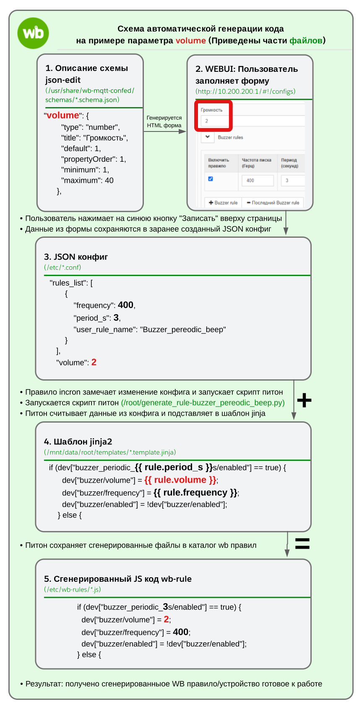
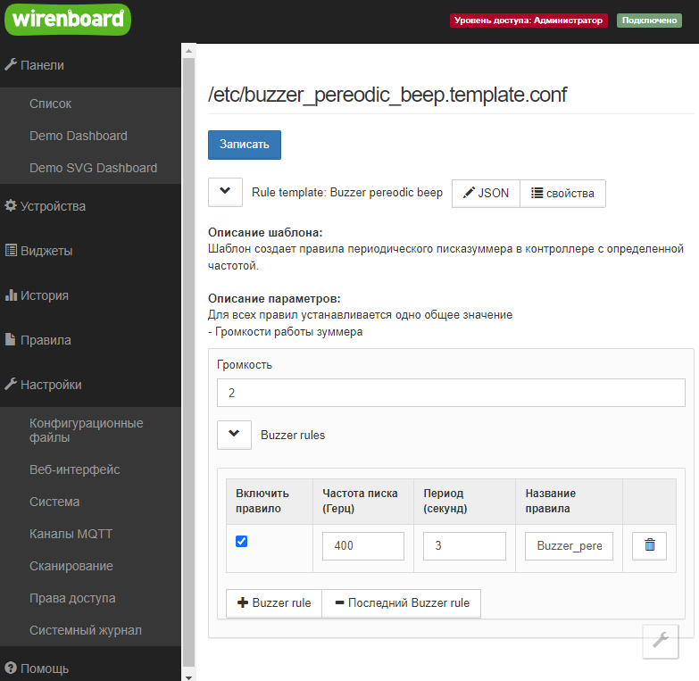
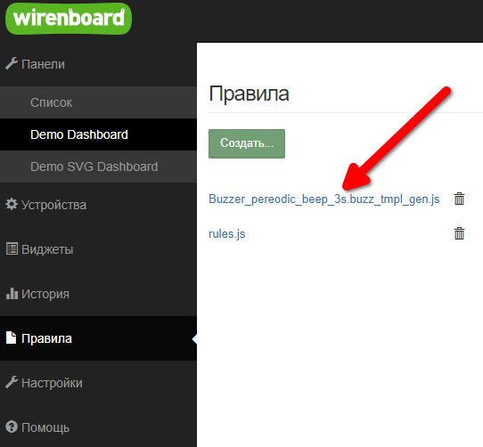

# json-editor_to_code example

<p align="left">
    
</p>

An example implementation of a WB-rules code generator that:

- Takes parameters from JSON-editor forms for multiple WB-rules (JavaScript scripts).
- Generates JavaScript code for multiple rules based on a Jinja template.

This example demonstrates the implementation of configuring parameters for
multiple rules that control the buzzer in the WB 8.4 controller for periodic
activation through fields in the WEBUI, followed by generating the rules
based on these parameters.


<p align="left">
    
</p>

Пример реализации генератора кода WB-rules который:

- Берет параметры из форм json-editor для нескольких правил wb-rules (скриптов JavaScript).
- Генерирует на основе шаблона jinja код нескольких правил на JavaScript.

В данном примере показана реализация конфигурации параметров нескольких
правил, которые настраивают buzzer (пишалку)
в контроллере wb 8.4 на переодическое включение через поля в WEBUI
и последующая генерация правил на основе данных параметров.

## Схема пути генерации кода

На схеме изображены этапы генерации кода wb-rules на основе данных полученных от пользователя:

<p align="center">
    
</p>

Данную схему можно изучить тут:\

- Lucidchart: <a href="https://lucid.app/lucidchart/9eead64f-01a1-4655-881c-7971d05c66c1/edit?viewport_loc=-2027%2C1424%2C2742%2C1274%2C0_0&invitationId=inv_7ee41d12-3a28-4115-8bd8-0559d6356120">generate_workflow_diagram</a>

## Принцип работы со стороны пользователя

Цель - дать пользователю способ генерировать wb-rules/виртальные устройства
по заранее написанному шаблону просто работая с графическими полями в WEBUI.

Поля выглядит таким образом

<p align="center">
    
</p>

1) Пользователь заходит в WEBUI контроллера Wirenboard
2) Меняет права доступа с Пользователь на Администратор
3) Заходит на страницу Настройки - Конфигурационные правила
4) Находит нужный шаблон в списке конфигов, например "Rule template: Buzzer pereodic beep"
5) Заполняет поля конфигуратора\
Данная форма создается с помошью json-editor схемы
6) При необходимости добавляет новое правило в список (если шаблон предусматривает список правил)
7) Нажимает сверху кнопку "Записать"
- При нажатии введённые в поля свойства сохраняются в `*.conf` файле в виде `json`
- Событие изменения файла конфигураци автоматически ловит сисиемная утилита incron
- incron запускает python скрипт
- Скрипт генерирует код js на основе jinja шаблона и записывает в папку wb-rules
- Система правил подхватывает новые правила и автоматически выполняет их логику
8) Полученная польза - пользователь создал скрипты на js (правила) не написав ни строчки кода

## Описание порядка реализации

В данной инструкции предпологается что контроллер находится в чистом состоянии, поэтому поясняются все необходимые моменты по настройке с нуля.

### 0. Предварительные требования
Предпологается что вы поверхностно слышали и понимаете смысл:
- JavaScript - язык программирования применяемый в wb-rules
- wb-rules - движек правил который используется для написания правил в контроллерах wirenboard
- json-editor - применяется для создания форм в WEBUI с помошью описания в json схемах
- python3 - язык программирования поможет нам связать сохраненные конфигурации json-editor с jinja2
- jinja2 - шаблонизатор который мы используем для генерации wb-rules
Можно освоить в процессе данного мануала

### 1. Продумать фукнционал
Перед тем как начать писать скрипт - нужно понять чего мы хотим.

Прописать и продумать:

- Примерную общую цель генерируемого скипта
- Используемые готовые виртуальные устройства или используемые выходы/протоколы
- Логику работы скрипта
- Какие нужны поля настроек для пользователя.

Например:

```text
Общий смысл:
Шаблон создает правила периодического писка зуммера в контроллере с определенной частотой.

Используемые ресурсы контроллера:
Используем готовое стандартное системно виртуальное устройство buzzer у которого уже есть свойства buzzer/frequency, buzzer/enabled
Исходники buzzer можно посмотреть тут:
https://github.com/wirenboard/wb-rules-system/blob/c2d2480d0ea1d8194d3b3303bda174b60a9cf115/rules/buzzer.js

Логика:
Хотим чтобы раз в несколько секунд включался и выключался buzzer с частотой звучания 3000 Гц

Изменяемые поля будут такие:
Для всех правил устанавливается одно общее значение
- Громкости работы зуммера
Для каждого добавляемого инстанса генерируемого правила будут задаваться
- Статус правила, чтобы отдельное правило можно было отключить
- Период срабатывания, чтобы регулировать время писка зуммера
- Частота писка (Обратите внимание что высокие частоты люди уже не слышат)
```

### 2. Подключиться к контроллеру

Для реализации задуманного нам понадобится подключение через кабель Ethernet rj-45 (получение ip по DHCP), так как нужны:

- Доступ по ssh в терминале или SFTP в файловом менеджере - для создания и редактирования файлов на контроллере
- Доступ к WEBUI в браузере - для работы с формами
- Подключение контроллера к интернету - для установки пакетов питона

Как это сделать описано для контроллера Wiren Board 8.4 в разделе: <a href="https://wirenboard.com/wiki/Wiren_Board_8#Ethernet">**Подключение к компьютеру**</a>


Наличие интернета на контроллере проверьте вводом в SSH консоли команды
```terminal
$ ping 1.1.1.1
```

### 3. Написать обычный скрипт (правило)
Перед тем как создавать генерируемый вариант правил - нам нужно написать статичный скрипт и отладить его работу.\
Это необходимо, чтобы мы могли дальше переделать его в генерируемый вариант без параллельной отладки фукнционала скрипта.

В данном примере мы создадим виртуальное устройство - buzzer_pereodic_beep которое будет иметь два состояния - включено или выключено.
Если включено - то будет изменять состояние buzzer раз в заданное колличество секунд (3с пищит, 3с молчит).

Пример готового правила описан ниже, обратите внимане - так как правило по дефолту включено `enabled:value: true`, то после его создания buzzer сразу начнет пищать.

Создайте новое правило на странице "Правила": http://10.200.200.1/#!/rules
```javascript
/* File: /etc/wb-rules/test_buzzer_periodic_4s.js */

defineVirtualDevice("buzzer_periodic_4s", {
  title: "Test Buzzer",
  cells: {
    enabled: {
      type: "switch",
      value: true
    }
  }
});

defineRule("1",{
  asSoonAs: function () {
    return dev["buzzer_periodic_4s/enabled"];
  },
  then: function () {
    startTicker("timer_4s", 4000);
  }
});
defineRule("2",{
  when: function () { return timers.timer_4s.firing; },
  then: function () {
    if (dev["buzzer_periodic_4s/enabled"] == true) {
      dev["buzzer/volume"] = 1;
      dev["buzzer/frequency"] = 300;
      dev["buzzer/enabled"] = !dev["buzzer/enabled"];
    } else {
      timers.timer_4s.stop();
      dev["buzzer/enabled"] = false;
    }
  }
});

```

Для отладки менять состояние правила можно как в самом коде руками, так и через добавленный в 2Панели" виджет `buzzer_periodic_4s/enabled`.

### 4. Описать WEBUI
После того как простой статичный скрипт отлажен - можно приступить к реализации WEBUI для его настройки пользователем.

**4.1. Создать файл схемы**
Тут описывается вид и поля WEBUI который будет использоваться для генерации правил
Файлы схем находятся тут:

```text
/usr/share/wb-mqtt-confed/schemas/*.schema.json
```

Файлы схем для генерируемых лучше назвать по какому-то шаблону, например добавив вначало config_template-*. Префикс нужен для отличия от обычных правил:

```text
config_template-<!user_name_for_template!>.schema.json
```

- Например для шаблона переодического пишания создадим файл

```path
/usr/share/wb-mqtt-confed/schemas/config_template-buzzer_pereodic_beep.schema.json
```

**4.2. Заполнить шаблон WEBUI обязательно указав**

- Title - это имя отображается как название конфигурационного файла в WEBUI

```json
"title": "Rule template: <!user_desc!>",
```

Например

```json
"title": "Rule template: Buzzer pereodic beep",
```

- Description - Описание отображается на странице конфига

```json
"description": "<b>Описание шаблона:</b><br>Шаблон создает правила периодического писка зуммера в контроллере с определенной частотой.<br><br><b>Описание параметров:</b><br>Для всех правил устанавливается одно общее значение<br>- Громкости работы зуммера",
```

- Пример файла

File: /usr/share/wb-mqtt-confed/schemas/config_template-buzzer_pereodic_beep.schema.json

```json
{
  "type": "object",
  "title": "Rule template: Buzzer pereodic beep",
  "description": "<b>Описание шаблона:</b><br>Шаблон создает правила периодического писказуммера в контроллере с определенной частотой.<br><br><b>Описание параметров:</b><br>Для всех правил устанавливается одно общее значение<br>- Громкости работы зуммера",
  "configFile": {
    "path": "/etc/buzzer_pereodic_beep.template.conf",
    "service": "wb-rules"
  },
  "properties": {
    "template_postfix": {
      "_comment_for_this_field": "Поле нужно для того чтобы делать отличающимися имена файлов в разных шаблонах - используется для маски при создании и удалении файлов",
      "title": "Постфикс генерируемых имен файлов",
      "type": "string",
      "default": "buzz",
      "options": {
            "hidden": true
          }
    },
    "volume": {
      "type": "number",
      "title": "Громкость",
      "default": 1,
      "propertyOrder": 1,
      "minimum": 1,
      "maximum": 40
    },
    "rules_list": {
      "type": "array",
      "format": "table",
      "title": "Buzzer rules",
      "uniqueItems": true,
      "items": {
        "type": "object",
        "title": "Buzzer rule",
        "properties": {
          "user_rule_name": {
            "title": "Название правила",
            "type": "string",
            "default": "Buzzer_pereodic_beep"
          },
          "frequency": {
            "title": "Частота писка (Герц)",
            "type": "number",
            "default": 300,
            "maximum": 7000
          },
          "period_s": {
            "title": "Период (секунд)",
            "type": "number",
            "default": 5,
            "maximum": 60
          },
          "enabled": {
            "title": "Включить правило",
            "format": "checkbox",
            "type": "boolean",
            "propertyOrder": 4,
            "value": true
          }
        }
      },
      "default": [
        {
          "user_rule_name": "Buzzer_pereodic_beep"
        }
      ]
    }
  },
  "required": [
    "volume"
  ]
}

```

После создания файла схемы - нужно создать файл сохраненной конфигурации, иначе при попытке открытия данного конфигурационного файла в WEBUI будет ошибка `Ошибка загрузки файла: Invalid config file EditorError`

**4.3. Создать файл конфигурации**
В данном файле хранятся созданные (через описанные вами выше в схеме) настройки шаблонов.

Файлы конфигураций расположены по этому пути:

```path
/etc/*.conf
```

Шаблон названия: `<!user_name_for_template!>.template.conf`
Постфикс `template` нужен для отличия конфигов шаблонов от обычных конфигов устройства.

- Например для шаблона переодического пишания

```path
/etc/buzzer_pereodic_beep.template.conf
```

- Пример файла

File: /etc/buzzer_pereodic_beep.template.conf
```json
{
  "rules_list": [],
  "template_postfix": "buzz",
  "volume": 1
}

```

**4.4. Проверить корректность работы вебки и сохранения в конфигурацию**

- Зайдите в раздел конфигураций
- Выберете то название которое раньше ввели в поле json - title. В данном случае это `Rule template: Buzzer pereodic beep`
- Проверьте что после нажатия на конфигурацию открывается страница с вашими полями и нет ошибки `Ошибка загрузки файла: Invalid config file EditorError`
- Добавьте какие нибудь данные в поля. Например чтобы отличались от указанных по умолчанию:

```text
Громкость=2
Нажать "+ Buzzer rule"
Включить правило=ок
"Частота писка"=400
Период (секунд)=3
Название правила = "Buzzer_pereodic_beep_3s"
Нажмите "Записать",
```

- В файле `/etc/buzzer_pereodic_beep.template.conf` вы должны увидеть обновленные данные в формате json

File: /etc/buzzer_pereodic_beep.template.conf
```json
{
    "rules_list": [
        {
            "enabled": true,
            "frequency": 400,
            "period_s": 3,
            "user_rule_name": "Buzzer_pereodic_beep_3s"
        }
    ],
    "template_postfix": "buzz",
    "volume": 1
}

```

### 5. Связка python + jinja

В данном пункте нужно написать скрипт питона который будет генерировать код на основе шаблона jinja

Установить нужные для данной задачи пакеты
```
$ apt install python3-pip
$ pip install jinja2
```

**5.1. Написать простой шаблон генерации для  jinja2 который содержит предпологаемые пробрасываемые переменные**

На данный момент на контроллере нет специального места для шаблонов - поэтому можете хранить их в своей домашней директории.
Если вы работаете от root и не создавали дополнительного пользователя, то можно расположить шаблоны по такому пути.

```path
/mnt/data/root/templates/*.template.jinja
```

Например:

```path
/mnt/data/root/templates/buzzer_pereodic_beep.template.jinja
```

Содержание файла для проверки просто содержит те переменные которые хотим проверить:

```text
/* WARNING: This file is automatically generated. Do not modify manually! */

Test:
 - template_postfix = {{ template_postfix }}
 - volume = {{ volume }}
 - rule.frequency = {{ rule.frequency }}
 - rule.enabled = {{ rule.enabled }}
 - rule_period_s = {{ rule.period_s }}
 - rule_user_rule_name = {{ rule.user_rule_name }}

```

Где `{{ rule.frequency }}` и тд - это переменные которые вы пробросите через питон.
Далее мы будем использовать этот файл в написании скрипта python

**5.2. Создать скрипт питон**
Скрипт нужен нам чтобы сгенерировать скрипты (правила) на основе введенных пользователем данных в WEBUI.

Логика будет следующая

- Прочесть файл json конфигурации, который был обновлен пользователем через WEBUI
- Удалить все старые сгенерированные файлы правил относящиеся к данному файлу шаблона и конфигурации
- Генерация файла для каждого добавленного в json правила на основе файла jinja шаблона
- Сохранение нового сгенерированного файла в `/etc/wb-rules/`

Путь до файла:

```path
/mnt/data/root/generate_rule-buzzer_pereodic_beep.py
```

Содержание файла:

```python
import json
import os
import re

from jinja2 import Environment, FileSystemLoader

# Путь к конфигурационному файлу который будем читать
CONFIG_FILE = '/etc/buzzer_pereodic_beep.template.conf'

# Папка для сохранения сгенерированных файлов - не изменяема, всегда нужно сохранять только сюда
OUTPUT_DIR = '/etc/wb-rules/'

# Папка где будем искать шаблоны jinja
TEMPLATES_DIR = '/mnt/data/root/templates'
TEMPLATE_FILENAME = 'buzzer_pereodic_beep.template.jinja'

def main():
    # Чтение конфигурационного файла
    with open(CONFIG_FILE, 'r') as f:
        config = json.load(f)

    # Регулярное выражение для сопоставления файлов
    postfix = config.get('template_postfix')
    pattern = re.compile(rf'.*\.{re.escape(postfix)}_tmpl_gen\.js$')

    # Удаление ранее сгенерированных файлов, соответствующих шаблону
    if os.path.exists(OUTPUT_DIR):
        for filename in os.listdir(OUTPUT_DIR):
            file_path = os.path.join(OUTPUT_DIR, filename)
            if os.path.isfile(file_path) and pattern.match(filename):
                os.unlink(file_path)
    else:
        os.makedirs(OUTPUT_DIR)
    
    # Настройка Jinja2
    env = Environment(loader=FileSystemLoader(TEMPLATES_DIR))
    template = env.get_template(TEMPLATE_FILENAME)
    
    # Генерация файлов для каждого правила
    for rule in config.get('rules_list', []):
        # Подготовка данных для шаблона
        data = {
            'volume': config.get('volume'),
            'template_postfix': config.get('template_postfix'),
            'rule': rule
        }
        
        # Рендеринг шаблона
        output = template.render(data)

        # Имя выходного файла
        output_filename = f"{rule['user_rule_name']}.{config.get('template_postfix')}_tmpl_gen.js"
        output_path = os.path.join(OUTPUT_DIR, output_filename)
        
        # Сохранение результата
        with open(output_path, 'w') as f:
            f.write(output)
    
    print('Генерация правил завершена.')

if __name__ == '__main__':
    main()

```

**5.3. Проверка вручную**
Попробовать вызвать скрипт напрямую и проверить в терминале есть ли ошибки

```terminal
$ python3 /mnt/data/root/generate_rule-buzzer_pereodic_beep.py
```

Если ошибок нет - проверить в разделе правил WEBUI - появились ли новые файлы\
(В системе эти файлы находятся в `/etc/wb-rules/*.js`)

В нашем примере правило в списке будет называться как: `Buzzer_pereodic_beep_3s.buzz_tmpl_gen.js`

<p align="center">
    
</p>

Проверить корректность генерации

- Появились ли реально сгенерированные файлы в списке правил
- Какие у них имена
- Проверить содержание

Внутри файла должно быть следующее содержание:

```text
/* WARNING: This file is automatically generated. Do not modify manually! */

Test:
 - template_postfix = buzz
 - volume = 1
 - rule.frequency = 400
 - rule.enabled = True
 - rule_period_s = 3
 - rule_user_rule_name = Buzzer_pereodic_beep_3s
```

### 6. Переделать статичный скрипт (правило) в шаблон jinja

На этом шаге нам нужно заменить все места где мы хотим подставлять данные из WEBUI (json-edit).

Обратите внимание, так как правило по дефолту включено - то сразу начнет пищать и не закончит пока вы не удалите правило.
Удалять правило нужно в момент когда buzzer выключен.
Это определеяется в параметре `enabled` - тут стоит `value: true`:
```javascript
    enabled: {
      type: "switch",
      value: true
    }
```

Пример шаблона jinja:

```javascript
/* WARNING: This file is automatically generated. Do not modify manually! */

defineVirtualDevice("buzzer_periodic_{{ rule.period_s }}s", {
  title: "Test Buzzer: {{ rule.user_rule_name }}",
  cells: {
    enabled: {
      type: "switch",
      value: {{ rule.enabled | lower }}
    }
  }
});

defineRule("1",{
  asSoonAs: function () {
    return dev["buzzer_periodic_{{ rule.period_s }}s/enabled"];
  },
  then: function () {
    startTicker("timer_{{ rule.period_s }}s", {{ rule.period_s }}000);
  }
});
defineRule("2",{
  when: function () { return timers.timer_{{ rule.period_s }}s.firing; },
  then: function () {
    if (dev["buzzer_periodic_{{ rule.period_s }}s/enabled"] == true) {
      dev["buzzer/volume"] = {{ volume }};
      dev["buzzer/frequency"] = {{ rule.frequency }};
      dev["buzzer/enabled"] = !dev["buzzer/enabled"];
    } else {
      timers.timer_{{ rule.period_s }}s.stop();
      dev["buzzer/enabled"] = false;
    }
  }
});

```

### 7. Ручная проверка генерации скрипта
Для этого запустим скрипт вручную

```terminal
$ python3 /mnt/data/root/generate_rule-buzzer_pereodic_beep.py
```

В результате мы должны получить файл скрипта следующего вида

File: /etc/wb-rules/Buzzer_pereodic_beep_3s.buzz_tmpl_gen.js

```javascript
/* WARNING: This file is automatically generated. Do not modify manually! */

defineVirtualDevice("buzzer_periodic_3s", {
  title: "Test Buzzer: Buzzer_pereodic_beep_3s",
  cells: {
    enabled: {
      type: "switch",
      value: true
    }
  }
});

defineRule("1",{
  asSoonAs: function () {
    return dev["buzzer_periodic_3s/enabled"];
  },
  then: function () {
    startTicker("timer_3s", 3000);
  }
});
defineRule("2",{
  when: function () { return timers.timer_3s.firing; },
  then: function () {
    if (dev["buzzer_periodic_3s/enabled"] == true) {
      dev["buzzer/volume"] = 2;
      dev["buzzer/frequency"] = 400;
      dev["buzzer/enabled"] = !dev["buzzer/enabled"];
    } else {
      timers.timer_3s.stop();
      dev["buzzer/enabled"] = false;
    }
  }
});

```


### 8. Добавить правило в incron
incron это утилита которая поможет нам при изменениях сохраняемого конфига автоматически отслеживать изменения json конфиг файла.

Она использует модуль ядра inotify - механизм уведомлений о событиях файловой системы, поэтому работает эффективно и не тратит много ресурсов в фоне.

**8.1. Установить incron**

```terminal
$ apt install incron
```

**8.2. Разрешить пользователю использоать incron**

Для того чтобы наш пользователь мог создавать новые правила incron - нужно внести его в файл для разрешения использования incron

```terminal
$ nano /etc/incron.allow
```
В открывшемся редакторе отдельной строкой написать имя пользователя, например root.

**8.3. Добавить новое правило incron**
Правило вносится в таблицу командой, после ввода которой появится редактор файла в терминале:

```terminal
$ incrontab -e
```

Если на прошлом этапе вы не внесли пользователя в файл - при вводе команды вместо открытого файла получите ошибку `user 'root' is not allowed to use incron`

Записать в открывшуюся таблицу команду

```text
/etc/buzzer_pereodic_beep.template.conf IN_MODIFY python3 /mnt/data/root/generate_rule-buzzer_pereodic_beep.py
```

Команда имеет следующий формат

```text
<path>  <mask>  <command>
<path>is absolute path of the directory to watch.
<mask> is event mask(in symbolic or numerical form).
<command> is executable file (or script) with its arguments.
```

**8.4. Проверить что команда корректно видится incron**

```terminal
$ incrontab -l
/etc/buzzer_pereodic_beep.template.conf IN_MODIFY python3 /mnt/data/root/generate_rule-buzzer_pereodic_beep.py
```

Теперь можно просто пользоваться WEBUI - incron будет автоматически следить за изменением файла конфигурации и запускать каждый раз скрипт питона который сгенерирует вам новый файл WB правила.

### 9. Проверить все со стороны пользователя
Когда все готово - можно пробовать пользоваться так как это будет делать пользователь.
Смотри описание выше, в разделе "Принцип работы со стороны пользователя"
