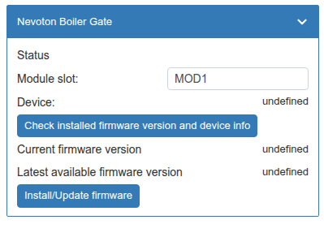

# Обновление прошивки модуля WBE2-I-OPENTHERM.
Данный скрипт предназначен для обновления модуля расширения WBE2-I-OPENTHERM (начиная с версии OT-ModBus V2.2 - указано на самой плате модуля)

## Добавление скрипта на контроллер
Скачайте файл скрипта (upd-wbe2-I-opentherm.js) из репозитория. Скопируйте на контроллер в папку  /mnt/data/etc/wb-rules/.
Далее через веб-интерфейс в меню "Устройства" станет доступным виджет для обновления модуля:

## Проверка доступности обновления
Укажите в "Module slot" номер слота, в который установлен модуль. В примере это "MOD1". Нажмите "Enter".
Подождите:

После завершения проверки на виджете отобразятся актуальные данные по номеру текущей прошивки и доступной:

