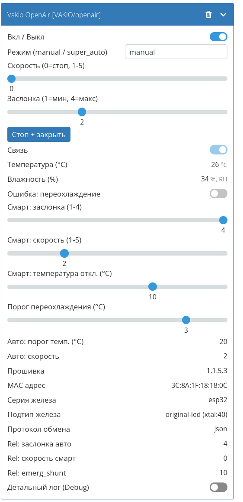

# Скрипт поддержки проветривателя OpenAir

Данный скрипт позволяет поддержать устройство  [Vakio OpenAir](https://vakio.ru/product/vakio-openair/). Скрипт работает с MQTT топиками Vakio по [документации](https://github.com/vakio-ru/vakio-public-api?tab=readme-ov-file#openair). Парсит все JSON данные и позволяет управлять проветривателем и и создает новое виртуальное устройство.

