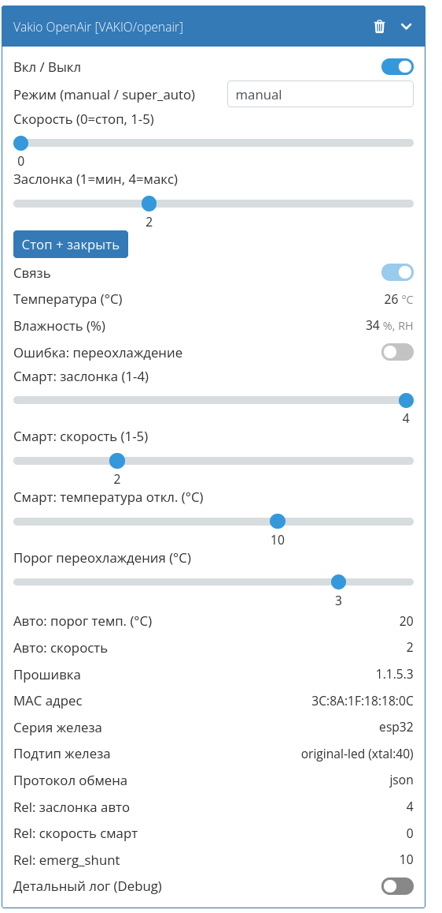

# Скрипт поддержки проветривателя Vakio OpenAir

Скрипт wb-rules для управления проветривателем [Vakio OpenAir](https://vakio.ru/product/vakio-openair/) с контроллера Wiren Board. Работает по [официальному MQTT API Vakio](https://github.com/vakio-ru/vakio-public-api?tab=readme-ov-file#openair) (JSON-обмен, прошивка Vakio от 1.1.0) и создаёт виртуальное устройство: вкл/выкл, скорость, заслонка, режим работы, температура и влажность, настройки смарт-режима, статус связи.

## Установка

1. Подключите Vakio к MQTT-брокеру контроллера (веб-интерфейс Vakio → настройки MQTT).
2. Скопируйте `VakioOpenair.js` в каталог `/etc/wb-rules/` на контроллере — правило подхватится автоматически, устройство появится в веб-интерфейсе.
3. Если в настройках Vakio задан топик, отличный от `vakio`, поправьте параметр `topic` в вызове `createVakioOpenAir` в начале файла.

## Известные ограничения

- На прошивке Vakio **1.1.6** устройство перестало отвечать на запрос состояния (`{"type":"auth"}` + легаси-команда `0687`): кнопка «Обновить данные с устройства» и периодический глубокий опрос не работают. На 1.1.5 всё работает; обновляться с неё не рекомендуем. Подробности — в [теме на форуме поддержки](https://support.wirenboard.com/t/skript-vakio/36205).

## Благодарности

Исправления совместимости с wb-rules (ES5/Duktape), топик по умолчанию и enum для режима работы — пользователь форума **plex**, [тема 36205](https://support.wirenboard.com/t/skript-vakio/36205).