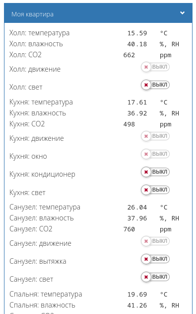

# Эмулятор данных для отладки скриптов

Скрипт генерирует виртуальное устройство с заданными именем и контролами. С его помощью можно быстро эмулировать систему автоматизации квартиры или дома, что удобно для всяких демонстрационных дашбордов.

Как пользоваться:
1. Создайте в контроллере новое правило и скопируйте в него содержимое файла `src/wb-flat-emulator.js`.
2. В переменных `devTitle` и `devName` задайте имя и заголовок виртуального устройства.
3. В переменной `emulator` укажите, нужно ли вам эмулировать значения.
4. В объекте `rooms` опишите комнаты и устройства в них. Типы доступных устройств описаны в объекте `proto`.

Никаких гарантий и поддержки. Удачи!