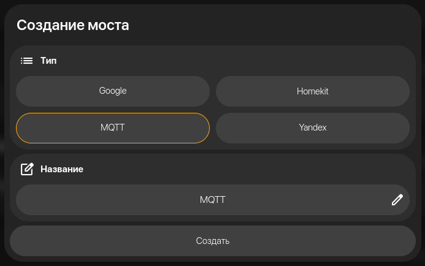
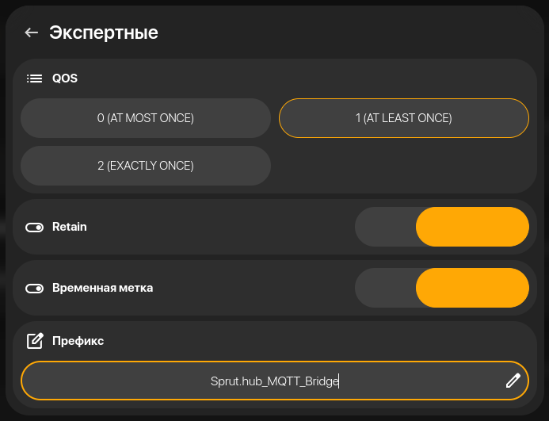
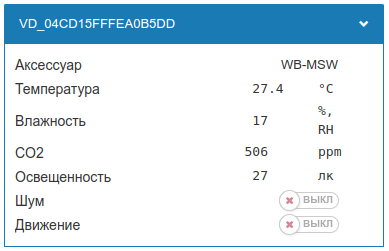

# Пример скрипта для прокидывания данных из Sprut.hub'а в Wiren Board.

Тестировалось на ревизии Sprut.hub'а [beta] 1.10.2 (13067).

Сперва неоходимо в Sprut.hub'е создать мост. Выбрать тип "MQTT". 

В настройках моста перейти в раздел "Экспертные" и указать перфикс, например,  "Sprut.hub_MQTT_Bridge".

В правиле реализована возможность добавления WB-MSW-ZIGBEE v4.

Необходимо заполнить префикс моста (SH_Bridge_Name), номера аксессуаров Sprut.hub'а (SH_Device_Name), которые хотите добавить в Wiren Board. А также указать необходимые наименования виртуальных устройств (VD_Name) в Wiren Board.

Если модель добавляемого аксессуара в самом топике Sprut.hub'а не 'WB-MSW', то виртуальное устройство не будет создано. Пример топика, куда публикуется модель аксессуара: `Sprut.hub-MQTT_Bridge/accessories/85/1/6`

